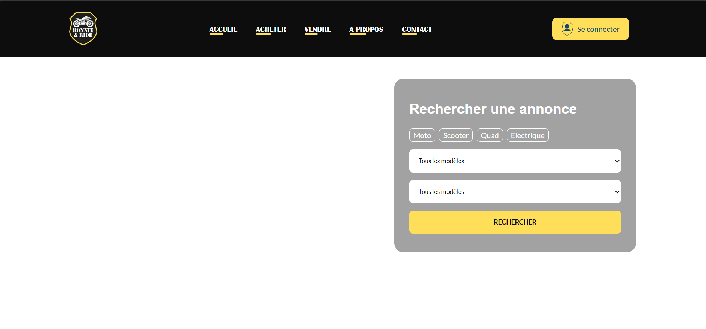

# Bonnie and Ride

Ce projet a été produit dans le but de proposer un site afin que l'entreprise bonnie&Car est un site web

## Table de matière

- [Aperçu](#Aperçu)
  - [Le défi](#Le-défi)
  - [Capture d'écran](#Capture-d'écran)
  - [Liens](#liens)
- [Mon processus](#Mon-processus)
  - [Environnement utilisé](#Environnement-utilisé)
  - [Ce que j'ai appris](#Ce-que-j'ai-appris)
  - [Developpement futur](#Developpement-futur)

## Aperçu

### Le défi

Le client souhaite un site:

- Riche
- Visuellement attrayant
- Facile à utiliser
- Responsive

### Capture d'écran

Nous avons adopté un look qui rappel les bikers américains qui permet de mettre en avant la passion et l'engagement du client

### liens

- github: [lien du github](https://github.com/quentinLourenco/bonnie-car)

## Mon processus

### Environnement utilisé

- html
- css
- js
- bootstrap
- php
- mysql

### Ce que j'ai appris

Tenir la time lane était compliqué et l'organisation avec des designers était une première pour nous.
Se mettre dans la peau du client et réussir à comprendre le cahier des charges était difficile pour nous et nous avons dû les solicités régulièremeent.

### Developpement futur

Nous allons continuer à améliorer le site en ajoutant des fonctionnalités, surtout de l'IA dans la recherche et les suggestion serait intéressant.
